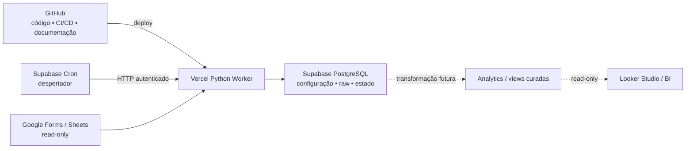

# ADR 20260911: arquitetura de execução agendada do sincronizador no MVP

## Status

Proposta.

Data: 2026-09-11.

Esta arquitetura é uma proposta para o MVP. Ela ainda precisa ser validada em
execução real. Limites, termos e custos de produção devem ser reavaliados antes
de qualquer escala ou onboarding comercial.

## Contexto

O projeto já possui um core Python que cobre leitura Google Sheets, snapshot,
normalização, diff, eventos e persistência PostgreSQL/Supabase. A arquitetura
existente também define isolamento por instituição e por fonte, lifecycle,
retry controlado, reconciliação de commit ambíguo, raw interno e futura camada
analítica separada.

Ainda é necessário decidir onde o worker Python será executado, quem dispara
cada sincronização e como operar o MVP com poucas plataformas e custo inicial
próximo de zero, sem impedir evolução futura.

Adicionar desde o início Cloud Run, Railway, Render, VPS ou outro runtime
independente aumentaria a complexidade operacional, o número de credenciais, a
observabilidade distribuída, o custo potencial e a superfície de manutenção.
Isso pode se justificar depois, mas não está demonstrado para o MVP.

## Decisão proposta

Adotar inicialmente GitHub + Vercel + Supabase, sujeitos aos critérios de
aceitação desta ADR:

- **GitHub:** código, versionamento, CI/CD e documentação.
- **Vercel:** portal web da Inicie, interface administrativa, endpoints da
  aplicação e uma eventual Vercel Function Python para sincronização, caso a
  validação confirme compatibilidade com duração, CPU, memória, rede e
  dependências do worker.
- **Supabase:** PostgreSQL, configuração das fontes, estado operacional,
  histórico de sincronização, camada raw, futura camada analytics e
  agendamento/orquestração leve por Supabase Cron.
- **Google Forms / Sheets:** origem dos dados, acessada somente para leitura.
- **Looker Studio / BI:** consumo read-only da futura camada analítica/curada,
  nunca das tabelas raw.

Supabase não será o runtime principal do ETL Python. Vercel não manterá um
worker permanentemente ativo. O modelo pretendido é request, execução e
finalização.

## Fluxo operacional proposto

1. Um Supabase Cron global atua como despertador.
2. O cron envia uma chamada HTTP autenticada ao endpoint server-side.
3. A Vercel Python Function inicia o worker e consulta as fontes elegíveis.
4. O worker lê o Google Sheets em modo read-only.
5. O core produz snapshot, valida e calcula o diff.
6. O worker persiste o resultado transacional no Supabase PostgreSQL.
7. Uma evolução posterior transforma raw em analytics curado.
8. O Looker Studio consulta somente essa superfície analítica com acesso
   mínimo.

O cron não executa o ETL pesado e não contém regras de sincronização. Ele
apenas desperta o worker. O processamento, os controles e as decisões por
fonte permanecem no core Python.

## Um cron global

Não criar um cron por cliente. Um único disparo global consulta as fontes
vencidas e processa apenas as elegíveis. O worker decide o que executar,
respeitando isolamento, `enabled`, lifecycle e controles de concorrência já
definidos.

Conceitualmente, cada fonte possui identidade, estado de habilitação, último
resultado e próxima elegibilidade. Nomes como `last_sync_at` e `next_sync_at`
são apenas exemplos operacionais: esta ADR não define colunas, não altera o
schema e não autoriza migration.

O lote do MVP permanece sequencial até evidência de que concorrência é
necessária. Falha de uma fonte não deve impedir a avaliação das demais.

## Periodicidade do MVP

Propor inicialmente uma execução global por dia devido ao baixo volume
esperado no MVP, impacto reduzido no Supabase, simplicidade operacional, custo
baixo e suficiência para demonstração e validação.

Uma execução diária não é requisito permanente. A periodicidade deverá poder
evoluir, após decisão e evidência, para intervalos como três horas, cadência por
fonte ou quase tempo real por webhook/evento.

## Responsabilidade do Supabase

Supabase permanece fonte de verdade para dados, configuração, estado,
histórico, raw e futura analytics. Também pode coordenar o disparo leve do
worker por Cron.

Não colocar diff, transformação pesada, chamadas Google ou regras extensas de
orquestração dentro do PostgreSQL. O Cron apenas dispara o endpoint autenticado.

## Responsabilidade da Vercel

Vercel hospeda o portal, APIs e, condicionada à validação técnica, a função
Python de sincronização. Cada invocação recebe o request autorizado, executa o
trabalho elegível e termina; não há processo residente.

O endpoint não deve prometer resposta síncrona ilimitada. Duração, volume e
modelo de erro serão medidos no gate técnico antes de esta ADR ser aceita.

## Reutilização do core Python

Não reescrever o core em TypeScript apenas para adequação à Vercel. A integração
deve ser uma camada fina:

```text
HTTP autenticado -> orquestrador Python existente -> resultado sanitizado
```

Não duplicar diff, hashing, retry, repository, tombstones, reconciliação,
lifecycle ou regras de isolamento. O mesmo core deve sustentar execução local,
validação e o eventual adapter serverless.

## Segurança

- A chamada Supabase Cron -> Vercel deve possuir autenticação forte e segredo
  rotacionável.
- Não expor endpoint público desprotegido capaz de iniciar sincronização.
- `service_role`, senha do banco, Service Account Google, connection strings e
  tokens ficam exclusivamente no ambiente server-side.
- O portal e o browser nunca recebem credenciais administrativas.
- Logs e respostas usam allowlist e não incluem payload, URL completa, token,
  credencial, célula ou Project Ref completo.
- Guards de ambiente continuam obrigatórios; a proposta não autoriza produção.
- Retry e resultado ambíguo preservam a política existente: não há retry cego
  após commit incerto.

## Isolamento

Esta ADR preserva a decisão de um projeto Supabase por instituição e o
isolamento de configuração, estado, execução e lock por fonte. O scheduler não
introduz multitenancy, não mistura projetos e não muda a estratégia atual.

## Looker Studio e BI

O Looker Studio não deve consultar `raw_import_rows`, `raw_current_rows` ou
payloads operacionais. O fluxo pretendido é:

```text
raw -> transformação -> analytics/views curadas -> acesso read-only -> Looker Studio
```

O BI recebe apenas os dados necessários e o menor privilégio compatível com o
caso. Analytics, views, grants/RLS e dashboard ainda são etapas futuras; esta
ADR não os declara implementados.

## Free tier e custo

O objetivo é minimizar infraestrutura e custo no MVP, evitando runtime
adicional enquanto GitHub + Vercel + Supabase forem tecnicamente suficientes.

Free tiers servem ao desenvolvimento, protótipo e MVP apenas enquanto seus
limites e termos permitirem. Esta ADR não afirma que produção será sempre
gratuita. Produção comercial deve revisar termos, limites, custos, orçamento e
risco de crescimento antes de onboarding em escala; planos pagos podem ser
necessários.

## Alternativas consideradas

### A. Cloud Run

Prós: runtime forte para Python/container, escalabilidade e jobs
independentes. Contras no MVP: nova plataforma, configuração, credenciais e
complexidade operacional. Decisão: não utilizar inicialmente.

### B. Railway / Render

Prós: deployment simples e bom suporte a Python. Contras: plataforma, limites,
custos e superfície operacional adicionais. Decisão: não utilizar inicialmente.

### C. GitHub Actions como scheduler

Prós: simples e adequado para protótipo. Contras: transforma CI/CD em runtime
operacional e é menos apropriado como arquitetura de produto. Decisão: não
utilizar como runtime principal.

### D. Vercel Cron

Pode ser opção futura ou complementar. A proposta atual prefere Supabase Cron
como coordenador porque o estado e a elegibilidade das fontes já estão no
Supabase. Limites comerciais não são assumidos nesta decisão.

### E. Trigger em tempo real pelo Google

Prós: menor latência. Contras: onboarding Google adicional, triggers/webhooks
por cliente, autenticação e retries extras. Decisão: adiar até haver requisito
de quase tempo real.

### F. VPS ou worker permanentemente ativo

Prós: controle de runtime e duração. Contras no MVP: provisionamento, patching,
monitoramento e custo operacional contínuo. Decisão: não utilizar inicialmente.

## Consequências positivas

- Menos plataformas e credenciais no MVP.
- Menor complexidade operacional e custo inicial.
- Reaproveitamento do core Python existente.
- Arquitetura mais simples de explicar e operar.
- Um scheduler central para fontes elegíveis.
- Portal e worker próximos no mesmo deploy.
- Supabase preservado como fonte de verdade operacional.
- Evolução gradual para fila, fan-out ou runtime dedicado sem reescrever o
  domínio.

## Trade-offs e riscos

- Funções serverless possuem limites de duração, CPU e memória.
- O worker Python na Vercel ainda precisa de validação com carga representativa.
- Processamento sequencial não escala indefinidamente.
- Free tier não é solução permanente garantida.
- Muitas fontes podem exigir fan-out, fila ou worker dedicado.
- Falha da Vercel pode afetar simultaneamente portal e worker.
- A fronteira Cron -> Worker exige autenticação forte, rotação e observabilidade.
- O disparo diário aumenta a latência máxima percebida no MVP.

## Gatilhos para revisar esta ADR

Revisar a arquitetura se qualquer condição ocorrer:

- o worker exceder limites de execução;
- o número de fontes ou o volume crescer significativamente;
- houver necessidade de concorrência real, fan-out ou filas;
- a sincronização exigir quase tempo real;
- custos Vercel/Supabase tornarem outra opção mais adequada;
- surgir SLA formal, isolamento regulatório ou requisito de disponibilidade;
- o processamento se tornar pesado em CPU, memória ou dados.

Nesses casos, considerar Cloud Run ou runtime dedicado equivalente, mantendo o
core Python e substituindo apenas a borda de execução quando possível.

## Diagrama conceitual

Este diagrama complementa, sem substituir, o
[fluxograma operacional](../diagrams/sheets_supabase_sync_operational_flow.drawio).



## Relação com decisões existentes

- [Supabase isolado por instituição](20260803_isolated_supabase_per_institution.md):
  mantém um projeto por instituição e não introduz multitenancy.
- [Política de schema drift](20260817_raw_schema_drift_policy.md): mudanças
  bloqueantes continuam dependendo de revisão humana.
- [Retry e commit ambíguo](20260819_operational_retry_policy.md): preserva
  retry limitado, releitura/diff e reconciliação sem repetição cega.
- [Lifecycle-aware](20260902_lifecycle_aware_code_rollout.md): somente fontes
  `enabled` e ativas podem iniciar execução.
- [Validação multi-source](20260902_multi_source_local_validation.md): mantém
  isolamento por fonte e lote inicialmente sequencial.
- [Contrato analítico mínimo](20260903_minimum_analytical_contract.md): BI
  consome analytics curado, nunca raw.
- [Segurança](../security.md): credenciais permanecem fora do cliente, do
  browser, dos logs e do Git.

## Critérios para mudar para Aceita

- Vercel executa o worker Python dentro dos limites medidos.
- O core existente roda sem reimplementação de domínio.
- O endpoint rejeita chamadas não autenticadas.
- Supabase Cron dispara o endpoint autenticado de forma comprovada.
- Uma fonte fictícia completa sincroniza ponta a ponta.
- Repetição idempotente é validada.
- Falhas e resultado ambíguo são observáveis e reconciliáveis.
- Secrets permanecem server-side e ausentes de browser, logs e artefatos.
- Guards continuam bloqueando produção não autorizada.
- Custo e limites observados do MVP são aceitáveis.

## Limites deste registro

Esta ADR não cria função, endpoint, cron, `pg_cron`, `pg_net`, secret, schema,
migration ou deploy. Também não altera Vercel, Supabase, Google, produção ou o
core Python. Qualquer implementação exige gate próprio, validação técnica e
revisão de segurança.
