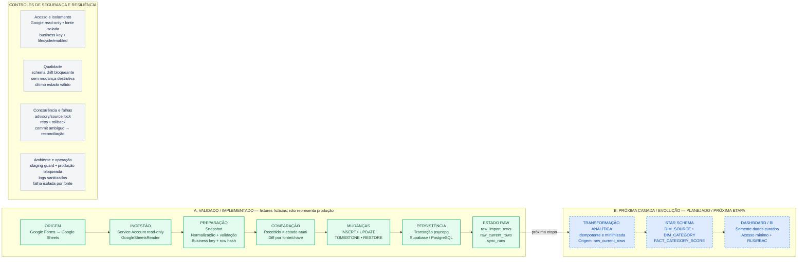

# Fluxo executivo — sheets-supabase-sync

Backup editável em Mermaid do fluxograma principal. O arquivo fonte para a
reunião é `sheets_supabase_sync_flow.drawio`.

Legenda:

- **VALIDADO:** evidência documentada com fixtures fictícias; não significa produção.
- **EM IMPLEMENTAÇÃO:** trabalho iniciado, ainda sem gate de validação completo.
- **PLANEJADO:** contrato/desenho aprovado, implementação ainda pendente.

Fontes: `docs/architecture.md`, `docs/workflow.md`,
`docs/activity-3/implementation-plan.md`,
`docs/decisions/20260806_inicie_etl_clientes_orientacao.md`,
`docs/roadmap.md`, `docs/decisions/20260819_operational_retry_policy.md`,
`docs/decisions/20260902_lifecycle_aware_code_rollout.md` e
`docs/decisions/20260903_minimum_analytical_contract.md`.
