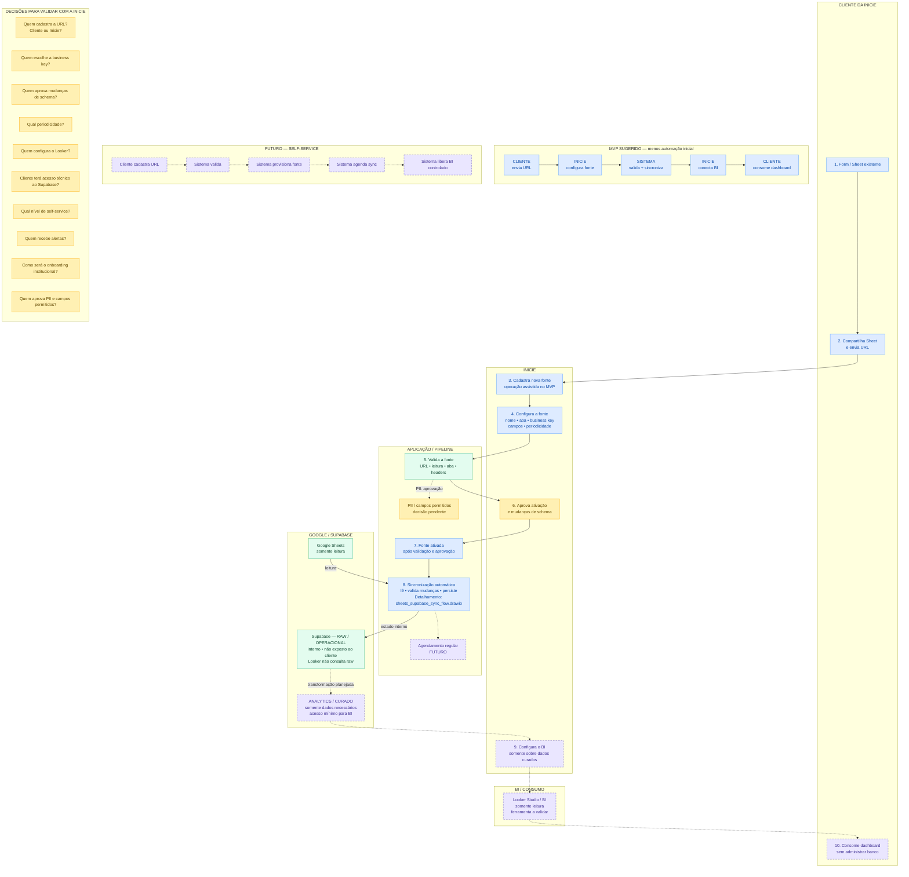

# sheets-supabase-sync | Fluxo operacional proposto

> **PROPOSTA PARA VALIDAÇÃO COM A INICIE** — não é fluxo definitivo de produto.

Fallback Mermaid do arquivo editável `sheets_supabase_sync_operational_flow.drawio`.

## Legenda

- **VALIDADO TECNICAMENTE:** comprovado no alcance documentado e com fixtures.
- **PROPOSTA OPERACIONAL:** forma sugerida de operar, ainda sujeita à Inicie.
- **DECISÃO PENDENTE:** responsabilidade ou regra ainda não definida.
- **FUTURO:** automação, analytics ou BI ainda não implementados.

O acesso proposto preserva a separação: o raw é interno, o cliente não recebe
`service_role` nem chave Supabase e o BI consome apenas a camada analítica
curada com acesso mínimo.
